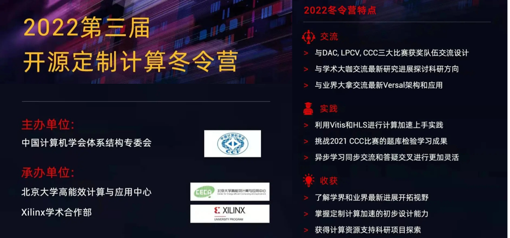

# 2022 开源定制计算冬令营

## Introduction:
2021年1月10日始，为期两周的冬令营*由CCF体系结构专委会主办，北京大学高能效计算与应用中心与Xilinx学术合作联合承办。  
北京大学，清华大学，计算所，浙江大学，北京工业大学，Xilinx等来自学术界工业界多位学者和资深工程师分享研讨了定制计算的前沿方向。  

## Agenda
| **模块** | **时间**             | **内容**                             | 备注                                                         |
| -------- | -------------------- | ------------------------------------ | ------------------------------------------------------------ |
| 1        | 1月10-12日 每天2小时 | Vitis HLS 入门（选听）               | 对HLS，计算机体系结构不熟悉的学员                            |
|          | 1月10日晚 8点        | HLS 设计原则入门                     |                                                              |
|          | 1月11日 白天         | 自行安排观看已录制Vivado HLS原理视频 |                                                              |
|          | 1月11日晚8点         | 从Vivado  HLS 到Vitis HLS设计流程    |                                                              |
|          | 1月12日              | 自行完成实验                         | 实验链接  [HLS Hands-on Labs](https://github.com/xupgit/High-Level-Synthesis-Flow-on-Zynq-using-Vivado-HLS) [Vitis Hands-on Labs](https://xilinx.github.io/xup_compute_acceleration/) |
|          | 1月13日 下午 2点     | Vitis 与Versal架构入门               |                                                              |
| 2        | 1月14日              | 完成Vitis  HLS 入门小测验            | 全部学员                                                     |
| 3        | 1月17日 全天         | DAC, LPCV, CCC,XACC等获奖项目分享    | 全部学员                                                     |
| 4        | 1月18日 开始         | 提供软硬件资源并指导完成科研项目尝试 | 项目计划获得批准的学员                                       |

## Invited Talks

### 1.17上午

| **时间**    | **题目**                                  | **报告人** | **学校**         |
| ----------- | ----------------------------------------- | ---------- | ---------------- |
| 9:30-9:50   | 基于神经网络的心肺音分离系统              | 李宗       | 武汉大学         |
| 9:50-10:10  | 基于FPGA的一种抗量子数字签名加密          | 徐嘉睿     | 南方科技大学     |
| 10:10-10:30 | 基于单目深度估计网络的全息显示终端        | 王瑞青     | 西安电子科技大学 |
| 10:30-10:50 | 基于RISC-V的积木式可拼接图形化编程系统    | 郑健       | 成都信息工程大学 |
| 10:50-11:10 | 基于边缘计算的低功耗全时空生态监控系统    | 贾凝心     | 西安邮电大学     |
| 11:10-11:30 | 基于ZYNQ FPGA的高精度双目光学定位导航系统 | 邢傲然     | 南方科技大学     |

### 1.17下午

| **时间**    | **题目**                                                     | **报告人**     | **学校**          |
| ----------- | ------------------------------------------------------------ | -------------- | ----------------- |
| 14:00-14:30 | CCC比赛初赛第一名队伍分享                                    | 岑宗俊，赵宗耀 | 清华大学          |
| 14:30-15:00 | CCC比赛冠军队伍分享                                          | 刘心哲，孙豪   | 上海科技大学      |
| 15:00-15:30 | ThundeRiNG:  Generating Multiple Independent Random Number Sequences on FPGAs | Hongshi Tan    | 新加坡国立大学    |
| 15:30-16:00 | ICCV-LPCV 冠军队伍分享                                       | 龚睿昊         | 商汤科技/北京大学 |
| 16:00-16:30 | 基于数据流的目标探测网络加速器DAC-SDC’21冠军队伍分享         | 姜伟雄         | 上海科技大学      |

## Other Materials:

关于更多信息也可以访问公众号获得，学堂->进阶教程中会公布每日视频回放  

