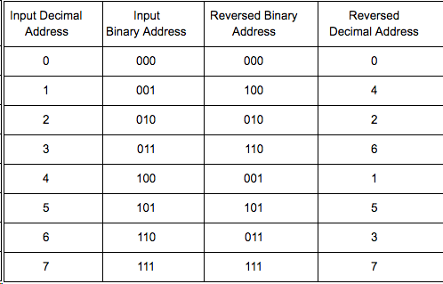

## Repository Tree
```
.
├── fft.cpp          //源码框架
├── fft.h            //头文件
├── fft_test.cpp     //测试源码
├── out.gold.dat     //标准输出
├── tcl_script.tcl   //tcl文件
└── README.md        //说明文件
```
## 快速傅立叶变换(FFT)  
  1）	框架代码说明
  >您可以直接在框架代码中“//Insert your code here”处实现算法基本功能，也可以根据您的设计对其适当的修改。  
  >但请注意：
  >**您必须保持fft.cpp，fft.h的文件名，以及顶层函数“void fft(DTYPE X_R[SIZE], DTYPE X_I[SIZE], DTYPE OUT_R[SIZE], DTYPE OUT_I[SIZE]) ”不变。**

  2）项目要求  
  >在本项目中，FFT实现分为多个阶段。FFT的第一阶段使用位反转方案对输入数据进行重新排序，即框架代码中的 bit_reverse 函数。8点FFT的位反转数据的示例如下：

  

  >第二阶段则需要logN（N为输入数据的个数）个stage进行蝶形计算，在框架代码中分为了“fft_stage_first”，“fft_stages”和“fft_stage_last”三个函数。  

  >在设计完成后，您可以使用我们提供的fft_test.cpp文件进行基本功能测试。但是，由于在评分时会统一使用评分系统内部的fft.h和fft_test.cpp文件，因此请不要将设计写在fft.h和fft_test.cpp中，fft.h和fft_test.cpp文件也无需提交。如果您有修改头文件的需求，您可以在设计中添加文件名不为fft.h的头文件。
  
  >**在HLS优化的过程中，请务必将优化指令设置为pragma写入c++代码中。**
  
  >比赛不需要生成最终bit文件，仅考察算法实现功能和综合报告的性能，能完成co-sim即可。


  3）提交程序
  >您仅需提交cpp文件和h文件。请将除fft.h,fft_test.cpp以外的所有cpp和h文件压缩为一个压缩包fft.zip，在页面下方您的解答处点击“上传代码”按钮进行提交，稍待片刻即可在文本框下方得知您的设计是否通过了基本功能测试。延迟、面积等性能指标则可在历史提交记录中点击版本号详细查看。
  
  4）评分规则
  >性能公式为：<br>
  >如果最大频率小于100MHz，视为未通过基本功能<br>
  >如果最大频率大于等于100MHz，但小于300MHz，使用公式**RTL simulation time/clock period/fmax**计算性能<br>
  >如果最大频率大于等于300MHz，使用公式**RTL simulation time/clock period/300MHz**计算性能<br>
  >其中RTL simulation time是Vitis HLS软件Cosimulation所用时间，clock period是tcl中设定的时钟频率，fmax是设计的最高运行频率。<br>
  >性能公式计算出的数值越小，性能越好。
  >
  >注意：设计的频率范围建议在100MHz和300MHz之间。如果频率低于100MHz，则未能满足最低性能指标，无法得到基本分10分；如果设计的最高运行频率高于300MHz，则在上方公式中也只会取300MHz作为最高频率。
